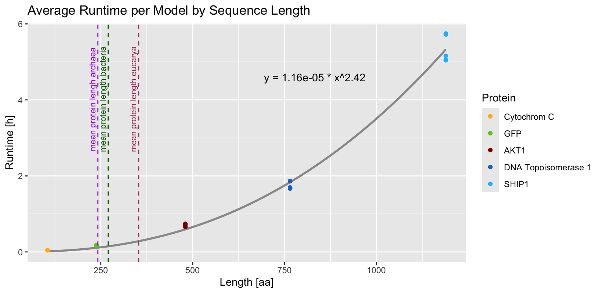
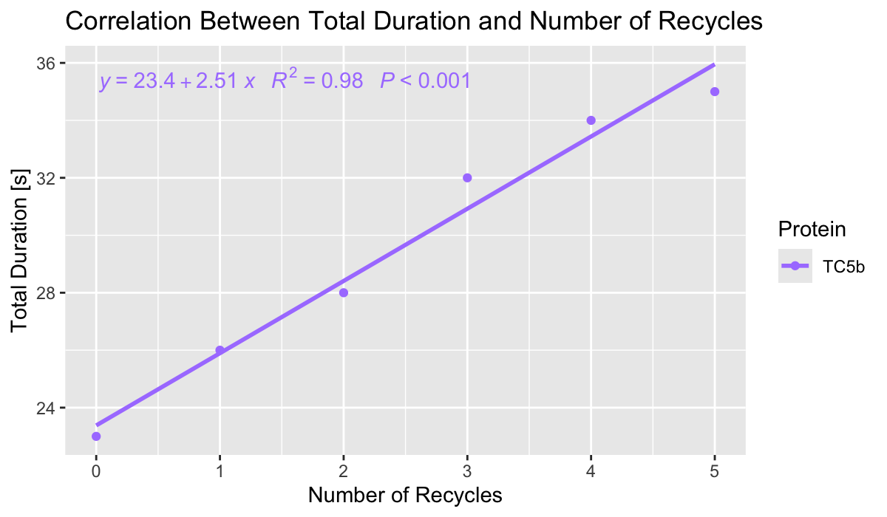
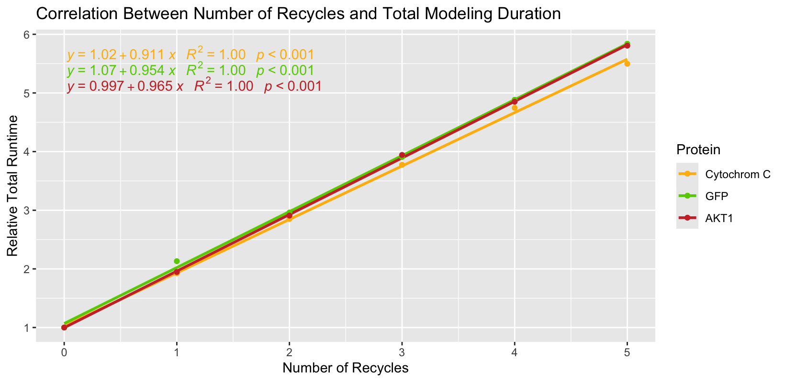

# ConformationLab Studio

> **Built for learning, inspired by science.**
> Submitted as Final Project in **Harvard University's CS50 Python: Introduction to Programming with Python**.

ConformationLab Studio is a desktop application for exploring **protein structure prediction** using **ColabFold / AlphaFold-based workflows** through a graphical user interface.

This project is primarily a **personal learning and research-oriented endeavor**, created to better understand software development, scientific tooling, and GUI design, while also lowering technical and financial barriers for students and early-stage researchers who want to experiment with protein structure prediction.

The application is written in **Python**, built with **Tkinter**, bundled using **PyInstaller**, and distributed as a **ready-to-run macOS application (.dmg)**.

---

## Table of Contents

* [About the Project](#about-the-project)
* [Motivation & Scope](#motivation--scope)
* [Key Features](#key-features)
* [Usage Overview](#usage-overview)
* [Use in Academia](#use-in-academia)
* [Technology Stack](#technology-stack)
* [Application Architecture](#application-architecture)
* [Included Files](#included-files)
* [Installation (Users)](#installation-users)
* [Installation (Developers / Build Process)](#installation-developers--build-process)
* [Version History](#version-history)
* [Acknowledgements](#acknowledgements)
* [Licensing](#licensing)
* [Disclaimer](#disclaimer)
* [Distribution](#distribution)
* [Contact](#contact)

---

## About the Project

ConformationLab Studio was created as a **learning-focused project** rather than a production-grade scientific tool.

Its goals are to:

* Explore **Python application development**
* Learn **GUI design with Tkinter**
* Understand **subprocess handling and environment management**
* Package complex scientific software into a **user-friendly desktop application**
* Provide an accessible entry point into **protein structure prediction**

While the application is functional and capable of running real predictions, it is **not intended to replace professional pipelines or HPC-based workflows**.

---

## Motivation & Scope

Protein structure prediction tools like AlphaFold and ColabFold are powerful but often difficult to install and configure.

ConformationLab Studio aims to:

* Reduce setup complexity
* Provide a visual, guided interface
* Bundle dependencies into a self-contained environment
* Enable experimentation without deep command-line knowledge

The project reflects an ongoing learning process and will continue to evolve over time.

---

## Key Features

* Graphical interface for **ColabFold batch predictions**
* Automatic extraction and setup of a bundled Conda environment
* Support for **monomer and multimer predictions**
* Configurable parameters:
  * Seeds & random seeds
  * Model selection
  * Recycles and early stopping
  * MSA modes and pairing strategies
  * Template usage
  * Amber relaxation
  * Output handling (ZIP, overwrite control)
* **Mol*** viewer integration
* Live status updates and progress indicators
* CPU & RAM monitoring
* Light / Dark mode auto-detection (system-based)
* Process control (start / cancel)

---

## Usage Overview

1. Select an **input FASTA file**
2. Choose an **output directory**
3. Configure prediction parameters (BASIC or ADVANCED mode)
4. Click **Run**
5. Monitor progress and system usage
6. View results or open structures in **Mol*** Viewer

The application prevents system sleep during long-running predictions.

[Video Demo]()

---

## Use in Academia

* Use in academia is explicitly encouraged.
* This application can be used to introduce students to modern protein structure prediction workflows and computational biology tools.
* It provides a simplified interface that allows students to explore sequence-based structure prediction without requiring extensive command-line experience.

---

## Technology Stack

* **Language:** Python 3.10
* **GUI:** Tkinter/Tkinter.tkk
* **Scientific Backend:**
  * ColabFold
  * AlphaFold2 (via ColabFold)
  * JAX (CPU-only)
* **Packaging:**
  * Conda / Conda-Pack
  * PyInstaller
* **Visualization:** Mol* Viewer (via pywebview)
* **System Monitoring:** psutil

---

## Application Architecture

```
ConformationLabStudio.py
│
├── Todos
│
├── APP_NAME, APP_VERSION, APP_AUTHOR
│
├── Imports
│
├── Classes
│   └── ToolTip
│
├── MAIN PROGRAM: main()
│   ├── initialize process
│   ├── create Tkinter window
│   ├── build UI layout
│   ├── build BASIC mode widgets
│   │   └── build_basic_mode()
│   ├── build ADVANCED mode widgets
│   │   └── build_advanced_mode()
│   ├── create buttons
│   │   ├── build_run_button()
│   │   ├── build_clear_button()
│   │   ├── build_cancel_button()
│   │   └── build_molstar_button()
│   ├── store everything in a shared "state" dictionary
│   └── start GUI event loop
│
├── HELPER FUNCTIONS
│   ├── UI configuration
│   │   ├── configure_grid()
│   │   ├── get_centered_geometry()
│   │   ├── configure_header_frame()
│   │   ├── configure_footer()
│   │   ├── configure_scrollable_frame()
│   │   ├── on_frame_configure()
│   │   └── on_canvas_configure()
│   │
│   ├── scrolling
│   │   └── on_global_mousewheel()
│   │
│   ├── path selection dialogs
│   │   ├── get_app_paths()
│   │   ├── create_path_selectors()
│   │   └── resource_path()
│   │
│   ├── environment setup
│   │   └── ensure_conflab_env()
│   │
│   ├── validation
│   │   └── create_validation_commands()
│   │
│   ├── widget builders
│   │   ├── build_output_wiget()
│   │   ├── build_status_frame()
│   │   ├── build_loading_frame()
│   │   └── advanced_toggle()
│   │
│   ├── UI effects
│   │   ├── apply_hover_effect()
│   │   └── hover_effect()
│   │
│   ├── keyboard shortcuts
│   │   ├── bind_shortcuts()
│   │   ├── shortcut_browse_input()
│   │   ├── shortcut_browse_output()
│   │   ├── shortcut_toggle_advanced()
│   │   ├── shortcut_run()
│   │   ├── shortcut_cancel()
│   │   ├── shortcut_clear()
│   │   └── shortcut_molviewer()
│   │
│   ├── shortcut overlay
│   │   ├── create_shortcut_overlay()
│   │   └── bind_shortcut_overlay()
│   │
│   ├── menu bar
│   │   ├── build_menubar()
│   │   ├── configure_about()
│   │   ├── configure_system()
│   │   └── configure_help()
│   │
│   └── system / theme
│       ├── is_dark_mode()
│       └── update_theme()
│
└── PROCESS CONTROL
    │
    ├── run button workflow
    │   ├── run_button_command()
    │   └── run_process()
    |       └── Subprocess Execution
    |           └── conflab_batch (ColabFold wrapper)
    │
    ├── cancel workflow
    │   ├── build_cancel_button()
    │   └── cancel_process()
    │
    ├── output utilities
    │   ├── write_output()
    │   └── safe_status_update()
    │
    ├── loading animation
    │   ├── start_loading_animation()
    │   └── stop_loading_animation()
    │
    ├── molviewer
    │   └── molstar_button_command()
    │
    └── shutdown
        └── on_closing()
```

Key design decisions:

* The Conda environment is **packed into a tar.gz archive**
* On first launch, the environment is **automatically extracted** into: ```~/Library/Application Support/ConfLabEnv```

* All predictions run inside this isolated environment
* No system-wide Python or Conda installation is required for end users

---

## Included Files

### Archive

Herein are saved all past scripts for version control before migration to GitHub and for easy access.

### Assets

The assets folder contains a .icns for generating an icon in the macs dock and a .png for the header inside the GUI.
A reference file is included, citing the appropriate scientific article according to AlphaFold's documentation, as AlphaFold has been used to generate the .icns and .png files from actual human proteins.

### Assisting Scripts

The application comes with one assisting script ```run_molstar.py``` which is used to launch a webpage within the application in a separate window.
This application is the Mol* Viewer, which can be used to analyze protein structures, such as those generated by this application and ColabFold.

### Build

Included for developers and for transparency about the build process, a file called ```ConformationLab_env_Generator.sh``` is included alongside ```ConformationLabStudio.spec```, which can be used to automatically install all dependencies, pack them into an environment file, and build the application with the aforementioned .spect file.

### Dist (not tracked)

Fully build application, according to ```ConformationLab_env_Generator.sh``` and ```ConformationLabStudio.spec```.

### Environment (not tracked)

Packed environment, according to ```ConformationLab_env_Generator.sh```.

### Src

The ```src``` folder includes the main script and a test script.

### Stats

Some **statistical analysis** was performed using this application for testing purposes:

"Results show a **near-quadratic relationship** between **sequence length** and average **runtime per model** (y = a × xb, with b ≈ 2, p < 2 × 10-16, ***), consistent with theoretical expectations for multiple-sequence alignment and model inference complexity."



"The tasks can be executed in the background, with light activities such as video playback, text editing, or web browsing having no significant impact on runtimes."

"Benchmarking with an **increasing number of recycles** demonstrated a **linear increase in runtime**.
This predictable scaling allows users to balance model accuracy and runtimes for their specific use cases."





"All shown benchmarks were conducted on entry-level equipment featuring Apple M1 or M3 chips, with a runtime difference of approximately 30 % observed between the devices.
Intel-based systems also delivered acceptable performance when running predictions through the application."

[Müller, S.M. Installation and Execution of ColabFold with AlphaFold2 for Local Protein Structure Predictions on Apple Devices. Presented at the Signal Transduction Society’s 28th Meeting on Signal Transduction CellCommSummit 2025, 2025.](https://www.zotero.org/spikemurphy)

### Text Files

Some text files are included with the **original licence texts** for ```AlphaFold2```, ```ColabFold``` and this program ```ConformationLab Studio```.
Other licenses from third-party products used are included as well with links to the original license texts.
Also included is a short **about**, a short **disclaimer** and a detailed **version history** summary.

Many of those files are used while building the application and are accessible via the menu bar.

---

## Installation (Users)

### macOS

1. Download the latest **ConformationLab Studio `.dmg`** from:
    * [Official website](https://murphy-biochemistry.github.io/ConformationLabWeb/en/) **or**
    * [GitHub Releases](https://github.com/SpikeMurphy/ConformationLabStudio/releases)
    > *or build from scratch as detailed below*
2. Open the `.dmg`
3. Drag **ConformationLab Studio** into the **Applications** folder
4. Launch the application

> No additional installation steps are required.

---

## Installation (Developers / Build Process)

> **Note:** This section is intended for developers and maintainers only.

### Prerequisites

* macOS
* Miniconda / Anaconda
* Xcode Command Line Tools

### Environment Generation (Automated)

An automated shell script is provided: [```ConformationLab_env_Generator.sh```](https://github.com/SpikeMurphy/ConformationLabStudio/tree/main/build)

This script:

* Creates a Conda environment `conflab`
* Installs ColabFold with AlphaFold support
* Pins compatible scientific library versions
* Installs GUI dependencies
* Packs the environment using `conda-pack`
* Prompts file organization
* Runs PyInstaller using the provided `ConformationLabStudio.spec` file

The final deliverable is a **one-file macOS application** with an embedded environment.

---

## Version History

A detailed version history is available in the text files under: [VERSIONS.md](https://github.com/SpikeMurphy/ConformationLabStudio/blob/main/text_files/VERSIONS.md)

---

## Acknowledgements

* ColabFold developers
* AlphaFold / DeepMind
* Open-source Python community
* Scientific open-data initiatives

This software does not relicense AlphaFold2 or ColabFold.  
It provides a graphical user interface and execution environment for them.

---

## Licensing

* **ConformationLab Studio:** MIT License
* **ColabFold:** MIT License (Third-party)
* **AlphaFold2:** Apache License 2.0 (Third-party)

See the included license files in the [text files](https://github.com/SpikeMurphy/ConformationLabStudio/blob/main/text_files/) for full texts and other third-party licenses.

---

© 2025 Spike Murphy Müller · Licensed under the MIT License

---

## Disclaimer

This software is provided **for educational and research purposes only**.

* No guarantee of correctness or suitability
* Not intended for clinical, diagnostic, or commercial use
* Predictions should always be validated independently

Use at your own risk.

---

## Distribution

This Application will be distributed by Murphy Biochemistry UG (haftungsbeschränkt) i.G.

[ConformationLab Web Companion Webpage](https://murphy-biochemistry.github.io/ConformationLabWeb/en/)

---

## Contact

**Author:** Spike Murphy Müller  
**Email:** [conformationlab@gmail.com](mailto:conformationlab@gmail.com)